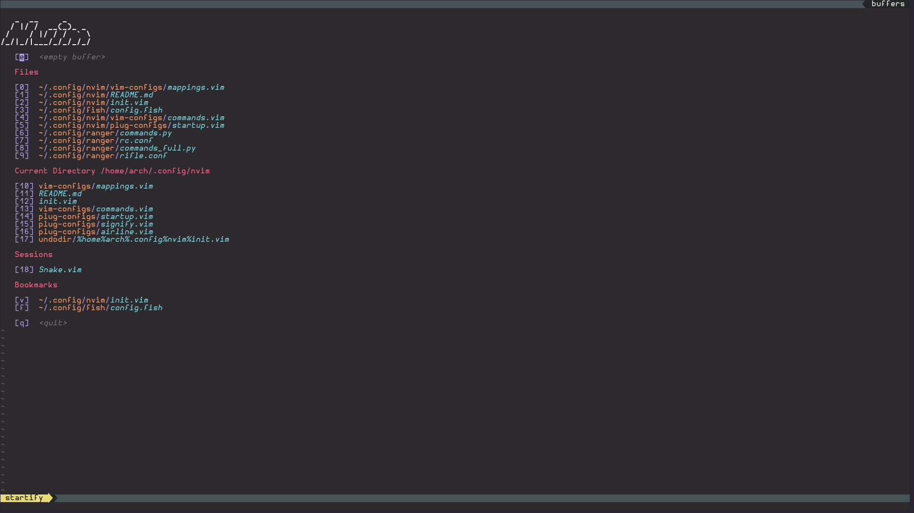

# VimLab
A simple Neovim Configuration i use for editing and programming.

## Screenshots

## Keybinding

The leader key is set to <space>

|Key|Command|
|---|---|
|leader+e|Explore|
|leader+t|Open a Terminal|
|tab;shift-tab|circle buffers|
|Ctrl-c|Escape|
|Ctrl-(h, j, k, l)|Window Movement|

## Creating a Project
For managing projects vim-startify was used. To create a project workspace follow these steps:
1. Create the Project Folder 
2. Execute SSave to save the Workspace
3. (opt.) Link the session to the project folder
4. (opt.) Create a local .nvimrc
